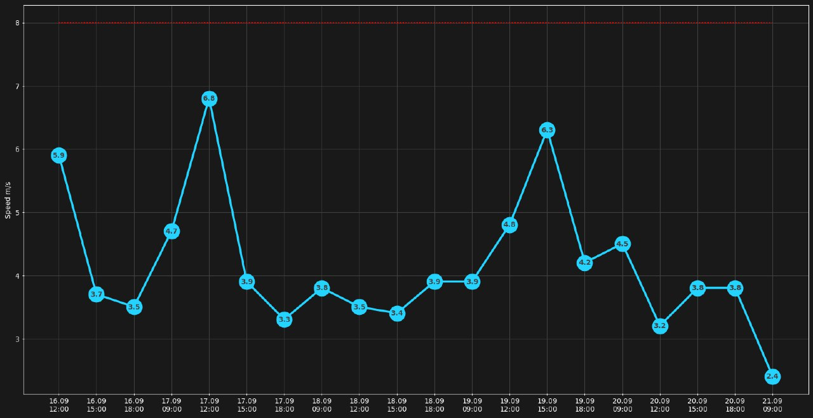
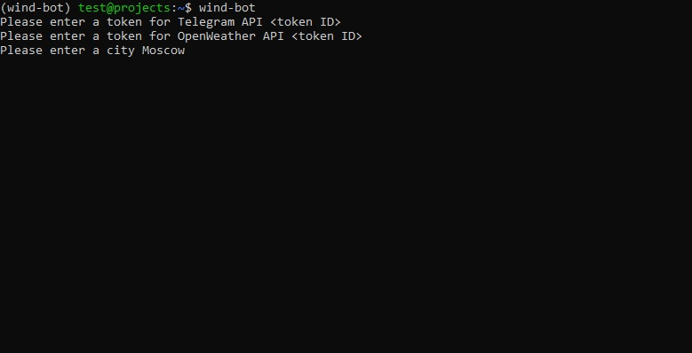

# wind-bot
Here you can find the simply way how to get visualization of the wind forecast directly to your telegram bot<br>
Example of the diagram

<br>
How it works:
 - Just send the message 'w' or 'wind' to a bot and it prepares the diagram for you <br>

<br>

How to install:
 - First of all please create a virtual enviroment (Example for Ubuntu is below):
 ```
 python3 -m venv wind-bot
 source wind-bot/bin/activate
 ```
 - On the second step please download some libriries:
 ```
 pip3 install matplotlib, requests, prompt, flake8
 pip install -i https://test.pypi.org/simple/ wind-bot
 ```
 [](https://asciinema.org/a/VJ4yE3kfh9rW1z4roWvYpiznG)
<br>
How to run:
1. Type 'wind-bot' and press enter
2. Create a bot in Telegram according to the [manual (step 3)](https://core.telegram.org/bots)
3. Register on [OpenWeather](https://home.openweathermap.org/users/sign_up) in order to get a token
4. Type your tokens in the command line
5. Chooce the city and push enter
6. Try to send the message ('w' or 'wind') in your bot



 
